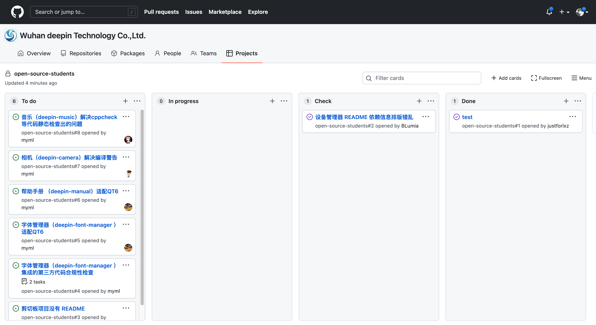

## deepin 开源实习生介绍

deepin开源实习生招募是deepin开源社区针对高校学生发起的实习活动，旨在鼓励在校学生积极参与开源项目，在实际的开源环境中提升实践能力。

实习任务由deepin开源社区提供，并提供导师辅导，学生通过实习申请后，可在社区领取任务，完成指定任务有机会获得由deepin开源社区发放的实习奖励。

  
### 一期实习时间

2022年3月18日-2022年6月18日（12周）

**实习奖励**

- 获得 deepin 开源社区颁发的实习证明
- 获得 deepin 开源社区颁发的“开源之星”证书
- 优秀的实习项目会融入 deepin 的版本更新计划中
- 作为分享嘉宾参与 DDUC 年度大会（包行程住宿）

**deepin开源实习生申请要求**

1. 无专业年级限制。
2. 每周能投入4小时以上的时间。
3. 按实习的报名要求提交相关资料。

## github 看板使用指南

看板地址: [https://github.com/orgs/linuxdeepin/projects/9](https://github.com/orgs/linuxdeepin/projects/9)

集中任务: [https://github.com/linuxdeepin/open-source-students](https://github.com/linuxdeepin/open-source-students)

看板可以集中处理所有任务，每位导师从 `Todo `中挑选任务移动到 `In progress` 分类中，并指派给具体的学生。

点击标题可以展开详情，点击详情中的 `Go to issue for full details` 按钮，打开任务讨论页面。

在任务详情页可以对任务进行状态更新，问题回复和讨论。

当任务完成后，由学生将任务从 `In progress` 移动到 `Check` 分类，相关导师会对任务进行核查，核查无误会将任务移动到 `Done` 分类进行归档，并关闭相关 Issue。
